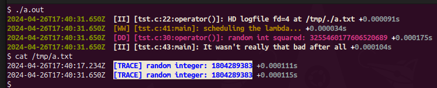

# liblogger

C++20 logging facility and slack messenger; Header-only library for logging.

User can either retrieve a singleton instance which logs to `stdout`/`stderr`,
or construct a new instance of logger backed by arbitrary `std::ostream`
object(s) (files, sockets, etc...).

Output lines are prefixed with ISO timestamps and suffixed
`+<duration>`,[debug](https://www.npmjs.com/package/debug)-style.

I/O is done in an asynchronous coroutine with a lock-free queue.

The global singleton instance is constructed with `stdin` and `stderr` and
propagated to all others statically linked copies of class under same PID (to
include dlopen'd .so libs) via mmapped POSIX shmem segment.

## Sample Session


## API

    - `Logger(outStream, errStream)`: constructor
      outStream and errStream defaults to `stdin` and `stderr`

    - `Logger::Info`, `Logger::Warn`, `Logger:Error`, `Logger:Debug`,
      `Logger:Trace`: different output levels with indicative formatting

    - `setUnifiedOutput(bool)`: use one stream for all IO

    - `setVerbosity(level)`: with `level` being one of
      `Verbosity::{QUIET, ERR, WARN, INFO, DEBUG, TRACE}`

    - `static Logger::get()`: retrieve global default-constructred singleton

## Sample usage

```c++
#include <fcntl.h>
#include <sys/stat.h>

#include <filesystem>
#include <future>

#include "logutil.h"

int main(int /*argc*/, char *argv[]) {
  auto &logger = Logger::get();  // default logger

  auto hd_logger = [&] {
    auto hd_logfile_path = (std::filesystem::temp_directory_path() / argv[0])
                               .replace_extension("txt");
    auto hd_logfile =
        open(hd_logfile_path.c_str(), O_CREAT | O_WRONLY | O_APPEND,
             S_IRUSR | S_IWUSR | S_IRGRP);
    auto hd_logger = Logger{hd_logfile, hd_logfile};

    hd_logger.setVerbosity(Logger::Verbosity::kTrace);

    INFO("HD logfile fd={} at {}", hd_logfile, hd_logfile_path.native());
    return hd_logger;
  }();

  auto const my_fn = [&] {  // by-ref capture for 'logger'
    const uint64_t i64 = ::rand();

    // global logger
    DEBUG("random int squared: {}", i64 * i64);

    // will not be output to stderr, since default logger's verbosity is DEBUG
    TRACE("random int: {}", i64);

    // but this will into its respective .txt stream
    hd_logger.Trace("[TRACE] random integer: {}", i64);

    return i64 % 2;
  };

  WARN("scheduling the lambda...");
  if ((std::async(my_fn).get() & 0b1LU) == 0) ERROR("what a flop.");
  INFO("It wasn't really that bad after all");
}
```

Output: 
